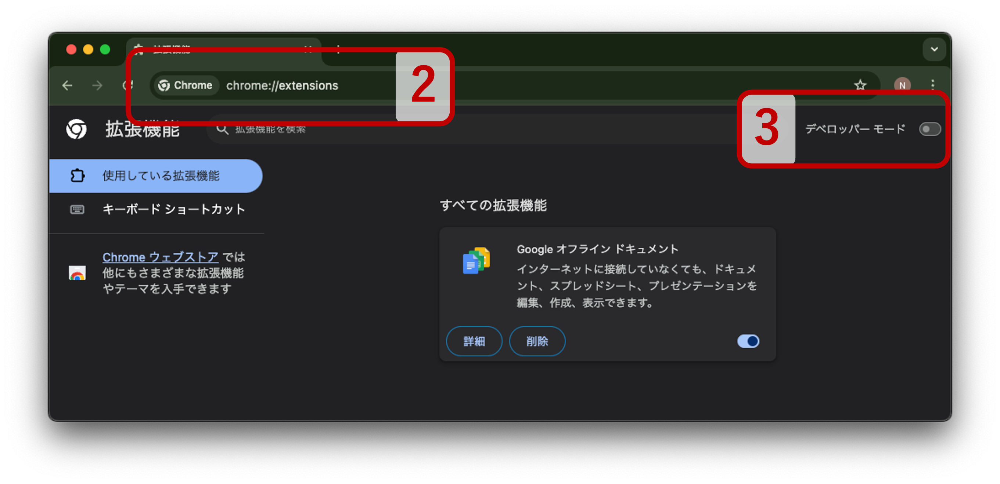
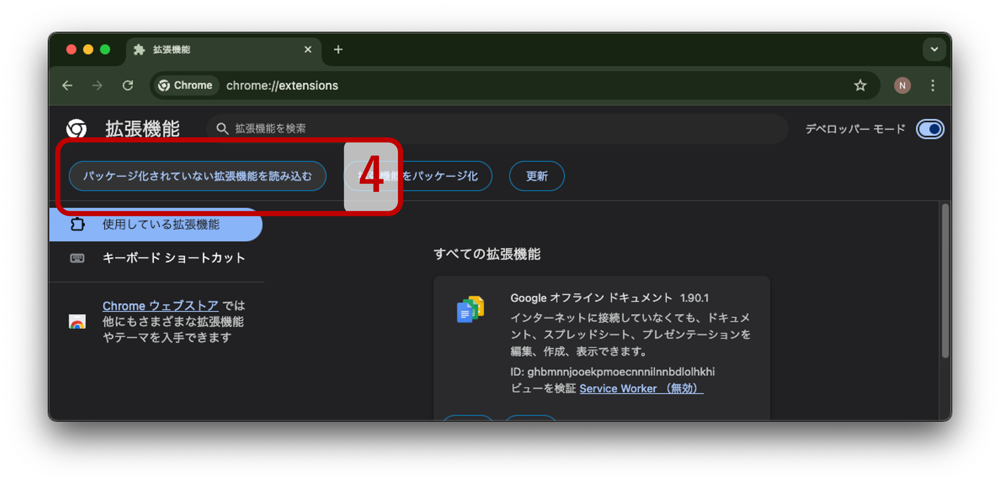

# Chrome拡張機能の作成
<div align="center">

[](https://www.typescriptlang.org/)
[](https://react.dev)
[](https://vite.dev/)
[](https://chakra-ui.com)

</div>

## インストール
本拡張機能は，以下の２通りの方法で利用できます
1. 配布ZIPファイルからインストール
2. ソースコードからビルドしてインストール


<details>
<summary><strong>1. 配布ZIPファイルからインストール</strong></summary>

1. [`dist.zip`](https://github.com/naokeyn/genRef/releases)をダウンロードして展開
2. Google Chrome を開き，アドレスバーに `chrome://extensions` と入力してEnterを押す
3. 右上の「デベロッパーモード」をオンにする


1. 「パッケージ化されていない拡張機能を読み込む」を選択し，1 で展開したフォルダーを選択



</details>

<details>
<summary><strong>2. ソースコードからビルドしてインストール</strong></summary>

以下の手順で，ローカルでビルドして読み込むことも可能です．

1. リポジトリをクローン
   ```bash
   git clone git@github.com:naokeyn/genRef.git
   cd genRef
   ```
2. `docker-compose` を使ってビルド
   ```bash
   docker compose run --rm app bash -c "cd app && npm run build"
   ```
3. プロジェクト内に`dist`フォルダが生成されます
4. Chromeの拡張機能ページで「パッケージ化されていない拡張機能を読み込む」をクリックし，`dist`フォルダを選択してください（1. 配布ZIPファイルからインストール を参考）

</details>


## Referencesの形式について
- [日本機械学会論文集](https://www.jsme.or.jp/publish/transact/for-authors.html#:~:text=web%E3%82%B5%E3%82%A4%E3%83%88)
- [AHFE_Template_LastName_FirstName_PaperID.pdf](http://ahfe.org/files/AHFE_Template_LastName_FirstName_PaperID.pdf)

クレジット
> <a href="https://jp.freepik.com/icon/papers_7680177"> &nbsp; 本アイコンの著作権はVector Squadにあります</a>

> 